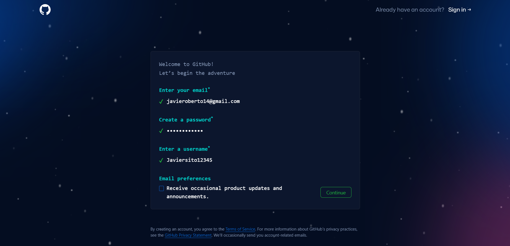

Este es un proyecto en Next.js con el fin de explicar cómo desplegar una tienda con su respectiva base de datos desde vercel y poder hacer la reportería desde Grafana.



## Requerimientos:
- Tener instalado Node.js versión 18 o superior.
- Tener cuenta en GitHub
- Tener cuenta en Vercel.com
- Tener cuenta en Grafana

## Pasos:
1. Forkear este repositorio en GitHub a tu propio repo de GitHub 
2. Crear una cuenta en Vercel.com
3. Conectar tu cuenta de Github a Vercel.com
4. Importar el Proyecto la-tienda a tu cuenta de Vercel
5. No te preocupes, te va a dar un error cuando se te esté desplegando la aplicación.  :)
6. Ir a STORAGE y conectar una base de datos en POSTGRES
7. Conectar el proyecto la-tienda a la base de datos de POSTGRES
8. Clonar el proyecto a tu computador local 
```bash
git clone $URL
cd la-tienda
npm install
export POSTGRES_URL= $DATABASE
npx prisma migrate dev
npx prisma db seed
```
9. Volver a Vercel, a DEPLOYMENTS y re-deployar la aplicación
10. Ahora en la aplicación se puede utilizar, tocando el boton VISIT.
11. FELICITACIONES! Puedes probar la aplicación.

## Reportería con Grafana

1. Ir a Grafana y crearse una cuenta conectando tu cuenta de GitHub.
2. Instanciar un Grafana
3. Crear un datasource 
4. Agregar la configuración que venga desde el storage de Vercel
5. Crear Gráficos.

## Consultas de SQL 
Usuarios que han comprado en la tienda y sus monto total. 

```sql
select sum,social_name FROM (select  sum(price), sale_id from sales_details group by sale_id) as t1
JOIN sales on sales.id=t1.sale_id JOIN users on sales.user_id=users.id 
```

Nombre del usuario que más ha comprado.
```sql
select social_name FROM (select max(sum) 
FROM (select SUM(price*quantity) 
FROM sales_details JOIN sales on sales.id=sales_details.sale_id GROUP BY user_id) as t1) as t2 JOIN (select user_id,  SUM(price*quantity) 
FROM sales_details JOIN sales on sales.id=sales_details.sale_id GROUP BY user_id) as t3 on t3.sum=t2.max 
JOIN users on users.id=t3.user_id
```
